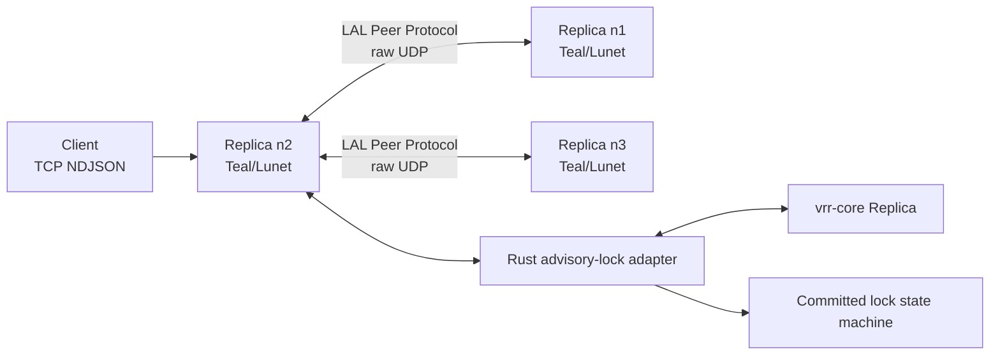
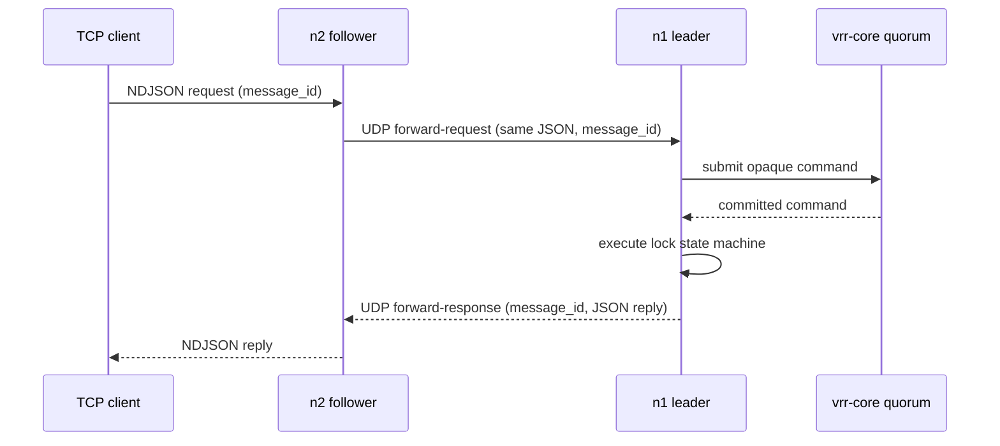

# Architecture and operations

This service is a fixed-membership, advisory-lock application built on
[`vrr-core`](https://github.com/lua-lunet/vrr-core). It deliberately keeps the
application protocol separate from replication: `vrr-core` orders requests;
the local adapter executes only committed lock commands and correlates their
JSON replies.

## Components



The **LAL Peer Protocol** is this service's UDP framing and forwarding layer.
It is not a replacement for VRR and it does not define replication state.
Its two jobs are to guard fixed membership at the transport boundary and to
carry service-specific forwarding packets alongside opaque VRR datagrams.

The Rust adapter retains the lock state machine, leader-side clock sampling,
and the durable recovery nonce. Teal owns sockets,
TCP framing, peer source validation, forwarding, and deterministic draining of
native output buffers. The Teal wrapper never retains a borrowed Rust pointer;
`close()` is idempotent and its LuaJIT finalizer is only a fallback.

## Client path

TCP is exclusively client-facing. A connection carries one newline-delimited
UTF-8 JSON request at a time; it can carry more requests sequentially after a
response. Partial reads and multiple frames in one read are retained correctly.
Each request must fit within the UDP datagram-sized service limit because a
nonleader may need to forward it unchanged.



A leader submits a client request locally. A nonleader forwards it to the
leader it currently knows. The forwarding node retains the original JSON and
canonical 16-byte `message_id` until the matching response arrives. Duplicate
client retries attach to that in-flight correlation rather than submit a new
command. The normal client deadline is 30 seconds; on expiry the service closes
the TCP connection, and the client retries the *unchanged* envelope.

## LAL Peer Protocol

All cluster-internal traffic uses raw UDP between configured member endpoints.
Before a UDP payload is handled, the receiver verifies that the source IP and
port exactly match a configured member. It then decodes this outer envelope:

```text
\0LUNET_ADVISORY_LOCK_PEER\0 | kind | membership fingerprint | payload
```

`kind` is either opaque VRR traffic or a service application packet. The
fingerprint is the first 16 lowercase hexadecimal characters of SHA-256 over a
domain-separated, length-delimited encoding of the validated lexical member
list (name, IPv4 endpoint, and port). Thus the same fixed membership has one
stable value, logged at startup as:

```text
advisory-lock membership fingerprint=<fingerprint> encoding=lunet-advisory-lock/membership/v1
```

The service wraps *every* native outbound VRR datagram and every application
packet in this envelope. It unwraps and compares the fingerprint before either
passing a packet to `vrr-core` or routing it as an application message. This
guards against accidentally connecting differently configured development,
test, or production clusters.

If a configured peer sends a valid envelope with a different fingerprint, the
replica becomes **dirty**. It logs the configured and received fingerprints to
both stdout and stderr, closes its TCP listener and active client work, and
continues its peer/recovery loops. It does not exit: this avoids a local crash
loop while TCP readiness correctly reports it unavailable. Operators must fix
the membership configuration and restart the replica.

## Leadership changes and forwarding

Forwarding packets have a distinct application tag inside the peer envelope:

- `forward-request`: canonical message ID plus the original JSON request;
- `forward-response`: canonical message ID plus the JSON reply;
- `not-leader`: canonical message ID plus the responder's current unsigned
  32-bit VRR view.

The fixed ordered membership maps a view to its leader. Consequently a
`not-leader` reply does not include a separate leader identity: the forwarding
node asks its local adapter for the leader of that view, immediately redirects
the retained original request when known, and otherwise resumes normal retry.


Only the replica to which a request was most recently forwarded may redirect
that request. An unknown leader simply leaves the request pending until normal
leader discovery/retry succeeds. A node that is not leader never executes the
forwarded application command.

## Time, recovery, and operational limits

The leader samples Unix milliseconds only when it accepts a request, placing
the selected value in the replicated command. Backups never sample their own
clocks while executing a committed command.

The `--state` file stores a recovery nonce. First boot creates it without
recovery. Every later boot and recovery retry atomically increments and
persists it before calling recovery. Recovery needs a live quorum. Simultaneous
durable restart of every replica is intentionally outside scope; an operator
must perform a fresh bootstrap only after all outstanding leases can no longer
be valid.

Default timers are 200 ms leader heartbeat, a 1,200 ms election floor plus a
200 ms per-node stagger, and 2,500 ms recovery retry. Override them with
`--heartbeat-ms`, `--election-ms`, and `--recovery-ms`.

Membership is fixed for one process lifetime. Peer transport is expected to be
on a private network; deployment infrastructure supplies encryption or other
network controls if required. Clients keep a stable `client_id`, use increasing
`request_num` values, retain only one outstanding request, and retry the exact
same envelope. See [the client protocol](client-protocol.md) for request and
reply semantics and [vrr-core](https://github.com/lua-lunet/vrr-core) for all
replication mechanics and safety proofs.
