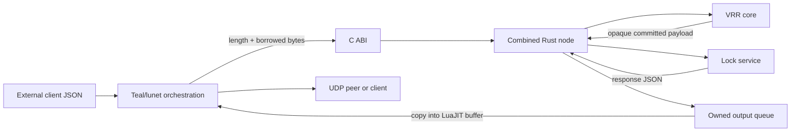
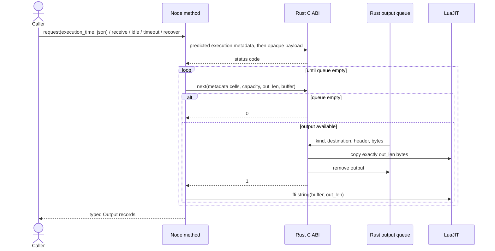

# Architecture

## Combined node facade

The FFI exposes one opaque node, not separate replication, lock-service, and serializer handles.
This is smaller and safer:

- Rust parses full-width JSON integers without converting them through Lua numbers.
- VRR orders the original client bytes as an opaque payload.
- Rust applies committed payloads to the lock service and serializes client replies.
- Teal sees only peer byte strings, client-response JSON, routing metadata, and a node handle.
- LuaJIT never observes a borrowed pointer into a Rust `Vec` or Rust object.



## Preferred technical and memory design choices

These are preferred project choices, not claims that competing stacks are universally wrong. They
record the current cost, performance, safety, and maintenance trade-offs so routine work does not
reopen Church-side decisions while implementing State-side lock behavior.

- lunet is the runtime and Teal is the shipped orchestration language. We prefer this small,
  explicit runtime over introducing a general web framework.
- Rust owns the exhaustive protocol match, replica state, request caches, response caches, and lock
  table. Teal does not reconstruct native protocol state.
- One combined opaque node is the ownership boundary. We do not expose independently managed
  replica, lock-service, serializer, or output-buffer handles.
- Construction immediately attaches a LuaJIT finalizer. Explicit `close()` first disarms that
  finalizer and then frees the node, preventing both leaks and double-free.
- Calls are synchronous at the ownership boundary. Each operation drains every resulting native
  output into Lua-owned records before returning to its caller.
- Input strings remain Lua-owned and are borrowed with explicit lengths only for the native call.
  Rust copies any bytes retained in a log, cache, or queue.
- LuaJIT owns one reusable UDP-sized output buffer and the scalar metadata cells. Rust copies queued
  bytes into that buffer; `ffi.string(buffer, length)` then creates an independent Lua string before
  the buffer is reused.
- Native output bytes are never returned as Rust-owned pointers. This avoids a second allocation
  ownership protocol and a matching byte-free function.
- Full-width integers remain JSON integers inside Rust or cross the boundary as decimal strings.
  They are not rounded through Lua's number type.
- Binary strings always carry explicit lengths. Embedded NUL bytes are data, except for the
  deliberately NUL-delimited membership vector where the wrapper rejects them.

These defaults SHOULD change only for a concrete requirement or measured problem, with the boundary
tests and this page updated in the same change.

## State ownership

| State | Owner | Crosses FFI? |
|---|---|---|
| Sorted membership and local node index | Rust `Replica` | Configuration bytes enter once |
| Epoch, status, log positions, log, client table | Rust `Replica` | No |
| Parsed uncommitted client request cache | Rust `Service` | No |
| Lock table and cached response JSON | Rust `Service` | No |
| Pending broadcast/send/reply bytes | Rust facade queue | Copied out, then removed |
| Opaque node pointer and output scratch cells | LuaJIT | Pointer only |
| 65,507-byte output buffer | LuaJIT | Rust writes into caller memory |
| Returned peer/client byte strings | LuaJIT | Created by `ffi.string(buffer, len)` |

The C ABI borrows input pointers only for the duration of a call. Rust copies any bytes it retains.
Output uses a caller-owned buffer, so there is no Rust byte pointer and no separate byte-free API.

## Construction and lifetime

```mermaid
sequenceDiagram
    actor Caller
    participant Teal as Teal wrapper
    participant JIT as LuaJIT FFI
    participant ABI as Rust C ABI
    participant Core as Replica
    participant Service as Lock service

    Caller->>Teal: new(sorted members, own address)
    Teal->>Teal: reject NUL in addresses; NUL-pack members
    Teal->>JIT: allocate void*[1]
    Teal->>ABI: lengths before member/own bytes
    ABI->>Core: validate K >= 3, sorting, uniqueness, own address
    ABI->>Service: create empty service
    ABI-->>Teal: opaque boxed node pointer
    Teal->>JIT: attach vrr_node_free finalizer
    Teal->>JIT: allocate metadata cells and UDP-sized buffer
    Teal-->>Caller: typed Node

    alt explicit close
        Caller->>Teal: close()
        Teal->>JIT: disarm finalizer
        Teal->>ABI: vrr_node_free(node)
    else garbage collection fallback
        JIT->>ABI: vrr_node_free(node)
    end
```

`close()` is idempotent. Every exported Rust operation catches panics so unwinding never crosses the
C boundary.

## Calls and output draining

All node operations enqueue zero or more outputs. The wrapper drains the queue before returning.



Explicit lengths preserve embedded NULs. A peer datagram with valid bytes followed by a NUL and
trailing data is rejected rather than silently truncated.

## ABI shape

The public Teal call is `Node:request(execution_time, json)`. Predicted execution metadata precedes
the opaque client payload under
[NOMA Collected Ordering](https://gist.github.com/simbo1905/c969d505ca531a301fea7f24f52ee0c9):
context and routing come first, then metadata before the opaque data it accompanies. The native-only
C ABI below retains that same order, with each length immediately before its byte range.

```c
int32_t vrr_node_request(
    void *node,
    size_t execution_time_len, const uint8_t *execution_time,
    size_t json_len, const uint8_t *json);

int32_t vrr_node_receive(
    void *node, uint32_t from,
    size_t message_len, const uint8_t *message);

int32_t vrr_node_next(
    void *node,
    uint32_t *out_kind, uint32_t *out_to,
    uint32_t *out_tag, uint32_t *out_epoch,
    uint32_t *out_slot_hi, uint32_t *out_slot_lo,
    size_t capacity, size_t *out_len, uint8_t *out_data);
```

Lua numbers do not represent every `u64`. Lease fields remain JSON integers parsed by Rust;
execution time and recovery nonce cross as decimal strings. A returned slot is split into exact
high and low `u32` values.

## Output kinds

| Native kind | Teal kind | Meaning |
|---:|---|---|
| 1 | `broadcast` | Send opaque peer bytes to every other member |
| 2 | `send` | Send opaque peer bytes to `replica` |
| 3 | `reply` | Return response JSON to the correlated client |

Peer messages remain opaque in Teal. The accompanying header record exposes tag, epoch, and exact
slot halves for routing, metrics, and tests without parsing the body.

## Native errors

Native calls return zero for success, except `vrr_node_next`, which returns one output, zero for an
empty queue, or a negative error. The Teal wrapper maps negative values to exceptions.

| Code | Meaning |
|---:|---|
| `-1` | Invalid or null argument |
| `-2` | Invalid membership |
| `-3` | Invalid decimal `u64` |
| `-4` | Malformed advisory-lock JSON |
| `-5` | Malformed or inconsistent VRR message |
| `-6` | Message exceeds one UDP payload or caller buffer |
| `-7` | Committed service payload could not execute |
| `-127` | Rust panic caught before crossing C |

At the raw C boundary, `(NULL, 0)` is accepted for borrowed bytes and `(NULL, nonzero)` is rejected.
The Teal wrapper always supplies explicit Lua string lengths and a non-null output buffer.

## Native loading

`src/vrr.tl` honors `LUNET_VRR_LIB`. Otherwise it chooses `dylib` or `so` from `ffi.os` and resolves
`ext/vrr/target/release/libvrr` relative to the generated module, not the process working directory.
