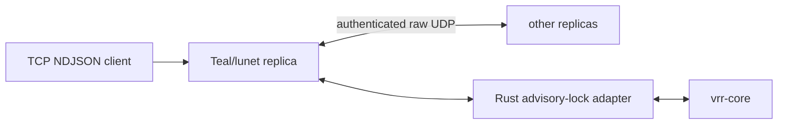

# Architecture and operations

The service has three layers:

The Rust adapter retains the local lock state machine. It passes opaque client
requests to `vrr-core`, executes only committed entries, and emits correlated
JSON replies. The FFI exports one opaque node. Teal drains its owned output
buffer after every call, so it never holds a borrowed Rust pointer. `close()`
is idempotent and the LuaJIT finalizer is a fallback.

## Client and peer traffic

Clients may connect to any replica. A leader submits directly. A nonleader
wraps the request in an application-only UDP envelope and forwards it to its
current leader; replies return through the same path. The envelope has a
distinct non-VRR magic prefix. Packets are accepted only when their UDP source
matches a configured member endpoint, and forwarding refuses payloads above
the single-datagram limit.

TCP input is newline-delimited JSON. The server buffers partial reads, accepts
multiple sequential requests on one connection, and processes one request at a
time. It retries an outstanding request against the current known leader for
up to 30 seconds. Failure to obtain a reply closes the TCP connection so the
client can retry the unchanged envelope.

## Time and recovery

The leader samples Unix milliseconds when it accepts a request and places that
value in the replicated request. Backups never sample their own clocks while
executing a committed command.

The `--state` file holds a recovery nonce. First boot creates it without
starting recovery. Later starts and recovery retries atomically persist an
incremented nonce before they invoke recovery. Recovery needs a live quorum;
a simultaneous durable restart of every replica is intentionally out of scope
and requires an operator-led fresh bootstrap after all leases can no longer be
valid.

Default timers are a 200 ms heartbeat, a 1,200 ms election floor plus a 200 ms
per-node stagger, and a 2,500 ms recovery retry. `--heartbeat-ms`,
`--election-ms`, and `--recovery-ms` override them.

## Security and limits

Membership is fixed for a process lifetime. Peer source checking assumes a
trusted deployment network; transport encryption and authentication are a
deployment concern. Requests and all forwarded traffic must fit in one UDP
datagram. Clients must retain a stable `client_id`, use increasing
`request_num` values, keep at most one request outstanding, and retry exactly
the same envelope.
