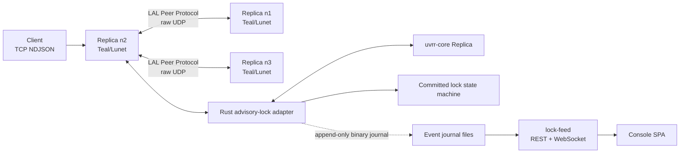
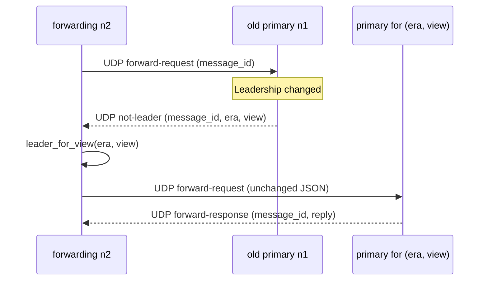

# Architecture and operations

This service is an advisory-lock application built on
[`uvrr-core`](https://github.com/lua-lunet/uvrr-core) (package `vrr-core`),
a sans-IO Viewstamped-Replication-Revisited core. The core is one total
function, `tick + message + state -> state + list(messages)`; the host owns
time, transport, storage, packetization, threading, and naming. The service
deliberately keeps the application protocol separate from replication:
the core orders requests; the local adapter executes only committed lock
commands and correlates their JSON replies.

## Components



The **LAL Peer Protocol** is this service's UDP framing and forwarding layer.
It is not a replacement for VRR and it does not define replication state.
Its jobs are to guard the deployment at the transport boundary and to carry
service-specific forwarding, membership-administration, and reincarnation
packets alongside opaque VRR datagrams.

The Rust adapter retains the lock state machine, the tick clock, exactly-once
reply correlation, and the durable incarnation marker. Teal owns sockets, TCP
framing, peer source validation, forwarding, and deterministic draining of
native output buffers. The Teal wrapper never retains a borrowed Rust pointer;
`close()` is idempotent and its LuaJIT finalizer is only a fallback.

## The deployment descriptor

Membership is the JSONL deployment descriptor supplied with `--cluster`.
Each line is one flattened JSON object `{"id":N,"name":"...","host":"...",
"port":N,"genesis":true|false}`, so the file diffs and greps like a log.
Each entry's `id` is that replica's live `NodeId` on the native ABI and in
peer routing: admin-assigned, sparse, and never recycled — a recycled id
would alias a superseded incarnation's identity. Ids are incarnation-0 ids
bounded to `[0, 16777214]` (the bump arithmetic below derives every later
identity in the high band, and id `16777215` is rejected because at
incarnation 255 it would collide with the reserved `LEADER_UNKNOWN` value).
The descriptor lists at least three genesis members; the genesis lines, in
line order, are the founding membership and the genesis succession sequence
(`primary(v) = order[v mod N]` in the core). A member that joined a live
cluster is appended after the genesis lines with `"genesis":false`, so the
descriptor relation between processes is a superset with the new member
appended and identical line order for shared members. Running processes
never reload the file.

## The adapter

The adapter instantiates the concrete core `Replica<SegmentedLog,
WeightedMajority>` running `Stability::Volatile`, provisioned over an empty
journal with the descriptor's genesis lines as the founding configuration.
Every input is wrapped in a `TimedInput` whose tick the adapter
stamps, planned against an atomic journal view, and published; the inert
effects the core releases are drained in the same call. A `Send { to, era,
message }` effect is encoded with the core's binary codec and queued as one
unicast datagram per destination — the core materializes fan-out as one send
per member, and the adapter routes each by member id. An `Apply { slot,
operation_id, payload }` effect is executed against the lock service, and the
adapter feeds the resulting `Input::Applied { slot }` acknowledgement back
into the core until it goes quiet.

Identity is the descriptor's admin-assigned ids. The native member buffer
carries NUL-separated `<id>:<name>` entries in descriptor line order, with
post-genesis entries suffixed `:j`; the genesis order is the genesis
succession sequence, and member ids are the ABI's peer addresses (`receive`'s
`from`, send outputs' `to`, and the leader outs all carry member ids). The
host maps id to endpoint through the live addressing tables it grows from
the descriptor. Operation identity is the client request's 16-byte
`message_id`: the first 8 bytes become the operation id's most-significant
word and the last 8 its least-significant word, both big-endian. The operation
payload is the client JSON bytes unchanged.

Exactly-once semantics are host-side. The core never deduplicates and never
answers a proposal, so the adapter caches each executed reply by `message_id`
and replays the cached bytes for a duplicate request or a duplicated committed
operation, without re-executing the lock service. A reply output is queued
only for an operation this node proposed and still holds locally pending.

The core carries operation payloads opaque and validates none of them, so the
adapter re-checks every peer-carried operation entry — in Prepare,
DoViewChange, StartView, and NewState messages — against the
lock service before the message reaches the core. An entry whose payload does
not decode as a valid service request, or whose embedded `message_id` does not
match the operation identity the entry claims, condemns the whole datagram.

A panic anywhere in the adapter poisons the node: pending outputs are
discarded and every subsequent call reports the poisoned state until the
process restarts. The same poison applies if the core ever surfaces a
durability handshake this host does not implement, or an application-state
shortfall it cannot repair — the adapter never fabricates state or a
durability outcome.

## Live reconfiguration

Membership changes are ordinary replicated operations. Four admin verbs —
`join`, `increment`, `decrement`, and `leave` — arrive over the same TCP
NDJSON client channel as the lock operations. They are operator-trusted at
exactly the same level: the TCP client channel has no separate
authentication, and any client that can acquire locks can propose membership
changes to the leader.

A non-leader replica forwards a verb through the ordinary
forward/redirect machinery. The leader drives the reconfiguration through
the native ABI (`Input::Reconfigure` with the operation the verb names —
`Join` at weight 0, `Increment`, `Decrement`, or `Leave`), deriving the
non-stop overlap pivot with the core's own `construct_pivot` against the
current configuration and the configuration the operation would fold. When
no legal pivot exists for that leader, the reconfiguration drives with no
pivot and takes the stop-the-world fallback — a latency outcome, never an
error. The era advances exactly at the establishing operation's commit;
every refusal leaves the log untouched.

The acknowledgment shapes are exact:

- an accepted verb answers `{"action":...,"id":...,"accepted":true}`, and
  only after the establishing commit has advanced the leader's era (the
  leader polls its status, whose era comes from the core's folded
  configuration);
- a core refusal (fold gate, transition-outstanding gate, poisoned replica)
  answers `{"action":...,"id":...,"accepted":false}` — nothing entered the
  log;
- an establishing commit that did not land within the client deadline
  answers `{"action":...,"id":...,"accepted":false,"reason":"deadline"}` —
  the verb may still commit later, so the leader answers honestly and
  duplicates of the same `message_id` replay that same first outcome from
  the leader's dedup cache.

Because the acknowledgment waits on the establishing commit, it can take
longer than a lock operation; a stop-the-world era entry in particular
awaits the ordinary fence.

The operator's sequences follow the core's weight rules:

- to add a member: `join` (the member enters at weight 0, a learner), then
  `increment` (the learner becomes a voter);
- to remove a member: `decrement` (the voter returns to weight 0), wait for
  that era to commit, then `leave` — a leave of a member above weight 0 is
  refused by the core's fold gate and reported as a rejected verb.

Endpoint addressing moves with two of the verbs. A `join` adds the joining
member's addressing row on every replica: the leader adds it before driving
the reconfiguration and broadcasts an application-level `ADMIN` packet at
proposal time (additive and idempotent at the peers, safe before the commit
because the core sends nothing to a pre-commit non-member). A `leave`
broadcasts after the commit, and the peers remove the departed id's rows —
never at proposal time, so a proposal that dies cannot strand a streaming
member. `increment` and `decrement` move no endpoint and broadcast nothing:
the peers learn weight changes from the replication stream.

A joining replica boots the joiner way: its descriptor line is appended as
non-genesis, and the process reopens over the deployment's genesis — the
one history every member holds — fenced until a committed `Join` admits it.
The committed Join folds the new era at every incumbent; the era's stream
then reaches the weight-0 joiner, which folds its admitting era and catches
up, still unable to influence quorums while its weight is 0. Authority
arrives only at the committed `Increment`.

## Client path

TCP is exclusively client-facing. A connection carries one newline-delimited
UTF-8 JSON request at a time; it can carry more requests sequentially after a
response. Partial reads and multiple frames in one read are retained
correctly. Each request must fit within the UDP datagram-sized service limit
because a non-primary may need to forward it unchanged; the adapter refuses a
request whose worst-case replicated Prepare encoding would exceed one
datagram before proposing it.


A primary submits a client request locally. A non-primary forwards it to the
primary it currently knows. The forwarding node retains the original JSON and
canonical 16-byte `message_id` until the matching response arrives. Duplicate
client retries attach to that in-flight correlation rather than submit a new
operation. The normal client deadline is 30 seconds; on expiry the service
closes the TCP connection, and the client retries the *unchanged* envelope.

## LAL Peer Protocol

All cluster-internal traffic uses raw UDP between descriptor endpoints.
Before a UDP payload is handled, the receiver verifies that the source IP and
port exactly match a descriptor endpoint. It then decodes this outer envelope:

```text
\0LUNET_ADVISORY_LOCK_PEER\0 | kind | membership fingerprint | payload
```

`kind` is either opaque VRR traffic or a service application packet. The
fingerprint is the first 16 lowercase hexadecimal characters of SHA-256 over a
domain-separated, length-delimited encoding of the **genesis** membership in
descriptor line order (id, name, IPv4 endpoint, and port). The deployment's
identity is its founding membership, so the same fingerprint is stable across
live superset growth — a joining member's descriptor never quarantines the
peers it joins — and across reincarnations. The value is logged at startup as:

```text
advisory-lock membership fingerprint=<fingerprint> encoding=lunet-advisory-lock/membership/v3 scope=genesis
```

The service wraps *every* native outbound VRR datagram and every application
packet in this envelope. It unwraps and compares the fingerprint before either
passing a packet to the core or routing it as an application message. This
guards against accidentally connecting differently configured development,
test, or production clusters.

If a configured peer sends a valid envelope with a different fingerprint, the
replica becomes **dirty**. It logs the configured and received fingerprints to
both stdout and stderr, closes its TCP listener and active client work, and
continues its peer loops. It does not exit: this avoids a local crash
loop while TCP readiness correctly reports it unavailable. Operators must fix
the deployment descriptor and restart the replica.

## Wire format

Inside the peer envelope, VRR payloads are the core's normative binary codec:
a 20-byte big-endian header `(tag: u32, era: u32, view: u32, slot: u64)`
followed by a one-byte body discriminant and fixed-width big-endian body
fields. There are no varints and no JSON on the wire. The core owns no size
limit; the host owns packetization, bounding every datagram to one IPv4/IPv6
UDP payload (65,507 bytes). The adapter reports each queued send's era, view,
and slot from the encoded message's header so the host never has to decode
it. The one VRR body the host does decode is `Reincarnation(old, new)`: the
pair is the restarted replica's addressing notice, described under
Reincarnation below.

## Leadership changes and forwarding

Forwarding packets have distinct application tags inside the peer envelope:

- `forward-request`: canonical message ID plus the original JSON request;
- `forward-response`: canonical message ID plus the JSON reply;
- `not-leader`: canonical message ID plus the responder's current era and
  view, each an unsigned 32-bit big-endian value;
- `ADMIN`: a membership change (a join's id, name, and endpoint, or a
  leave's id), length-delimited and strictly shaped; a payload that does
  not decode is dropped, never partially applied.

A `not-leader` reply does not include a leader identity: every replica maps
the supplied era-and-view pair to its primary through its local adapter, via
the core's folded configuration history.



Only the replica to which a request was most recently forwarded may redirect
that request. An unknown primary simply leaves the request pending until
normal discovery/retry succeeds; the adapter reports "primary unknown" for an
era outside the core's three-era retention window or a booting cluster. A node
that is not primary never executes the forwarded application command.

## Status surface

The adapter reports the replica's current mode — `normal`, `view_change`,
`recovering`, or `replaying` — together with the current era, current view,
and the member id of the current view's primary. The era and view come from
the core's folded configuration: the committed configuration history is the
commit truth, so the era advances exactly when the establishing operation of
a reconfiguration commits. `leader_for_view(era, view)` answers the primary
of an arbitrary era-and-view pair through that same configuration history,
or "unknown" when the era falls outside the retention window.
`lunet_lock_node_own_id` reports the replica's live identity: the descriptor
id at incarnation 0, the bumped high-band id after a dirty restart.

## Lock-event journal and console feed

Each replica optionally maintains an append-only binary journal of committed
lock transitions (hold, renew, release) under a per-replica directory. The
journal is observability data: it never participates in replication or
recovery, and a journal error disables journaling without affecting the
service path. Files roll by byte threshold and are never deleted by any
component.

The `lock-feed` process serves the journal directory over REST and WebSocket.
The nginx reverse proxy maps `/feed/` to lock-feed with WebSocket upgrade
support. The console SPA pulls rolled files via HTTP, tails the open file via
WebSocket, persists events to IndexedDB keyed by `[ts, lockId, leaseId]` for
idempotent replay, and applies a tombstone-ahead merge rule so releases that
arrive before their acquisition produce a correct active-lock view regardless
of ingestion order.

See [the event journal reference](event-journal.md) for record and metafile
byte layouts, file naming, resume-on-reopen semantics, corrupt-tail
tolerance, and the full console catch-up model.

## Time, reincarnation, and durability

The adapter owns the tick clock: a monotonic nondecreasing
milliseconds-since-Unix-epoch value, clamped per node so a wall-clock
regression never reaches the core. Every input the adapter feeds the core
carries such a tick. The core's single liveness input is a tick; the service's
heartbeat and election loops both drive it, and the core's configured
primary-timeout knob — five seconds of primary silence — is what fences a
backup into the next view. The service's recovery loop drives the fenced-boot
attempt while a replica is recovering: the drive ticks the core and, on a
reincarnated node, re-announces its `(old, new)` pair.

The `--state` file is the durable incarnation marker, the only bytes this
service ever fsyncs. It holds one line, `<incarnation> <flushed|unflushed>`,
written atomically (write, fsync, rename, parent-directory sync). The marker
classifies the boot: `flushed` is a clean start under the same identity;
`unflushed` is the running sentinel every operating process leaves behind,
so a restart of a process that has been running classifies **dirty**.

A dirty restart reincarnates the replica — the core's Crash-Stop-Self-Evict
protocol. There is no same-identity recovery after volatile-state loss: the
incarnation counter bumps, the marker is rewritten under the new identity,
and the bumped replica reopens over the deployment's genesis. Its fresh
identity is derived deterministically, without operator intervention:
descriptor ids live in the low band `[0, 16777214]`, and the k-th
incarnation's identity is `low + k * 16777216` — a unique high-band id that
can never alias a descriptor id, never overflow an unsigned 32-bit value, and
never reach the reserved `LEADER_UNKNOWN` value; the bump refuses at
incarnation 255 rather than wrap a superseded identity back into
circulation. The bumped replica announces `Reincarnation(old, new)` on the
VRR channel at boot and on every later fenced drive. The wire body *is* the
addressing notice: a replica that receives the pair from the socket the
deployment attributes to `old` moves that endpoint row to the new id and
delivers the announcement attributed to the new identity, where the core's
own gates apply — only the leader acts on it, and a forged or degenerate
pair is dropped by name. No descriptor change and no application broadcast
accompany a reincarnation. The leader drives the resurrection through the
ordinary reconfiguration pipeline — the forced two-era sequence that ends
with the new identity at weight 1 in the old succession position and the old
identity evicted — and the sequence continues tick-driven, recomputed
idempotently from the committed configuration, across leadership changes.

Durability is a stated property of the design. Under `Stability::Volatile`
the core keeps protocol state in quorum memory, not local storage: a rolling
single-node restart rejoins through reincarnation, while a simultaneous
full-cluster loss forfeits whatever the quorum held. An operator
re-bootstrapping a lost cluster must do so only after all outstanding leases
can no longer be valid.

Default timers are 200 ms heartbeat, a 1,200 ms election floor plus a 200 ms
per-node stagger (the descriptor's genesis ranks; the first line's member has
zero stagger and is the genesis primary), and 2,500 ms recovery retry.
Override them with `--heartbeat-ms`, `--election-ms`, and `--recovery-ms`.

Peer transport is expected to be on a private network; deployment
infrastructure supplies encryption or other network controls if required.
Clients keep a stable `client_id`, use increasing `request_num` values,
retain only one outstanding request, and retry the exact same envelope. See
[the client protocol](client-protocol.md) for request, reply, and
membership-administration semantics and
[uvrr-core](https://github.com/lua-lunet/uvrr-core) for all replication
mechanics and safety proofs.
