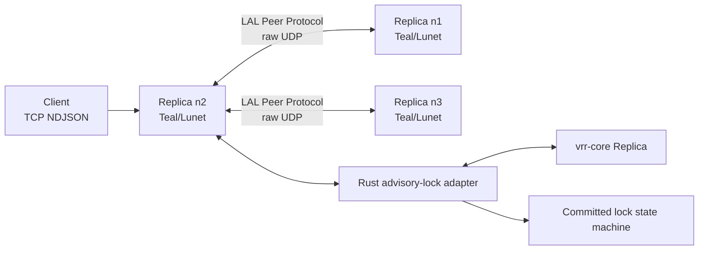
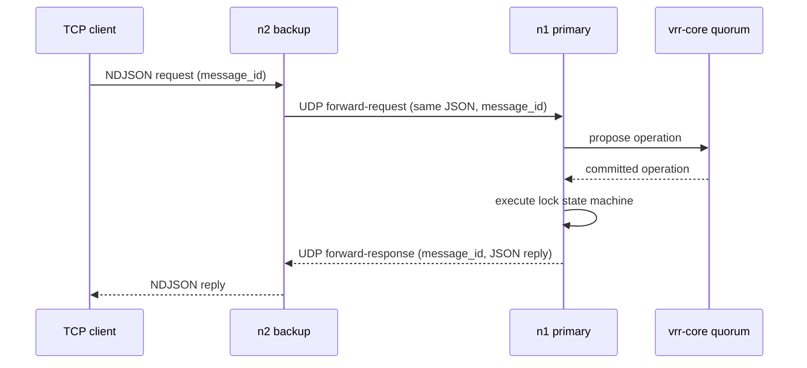
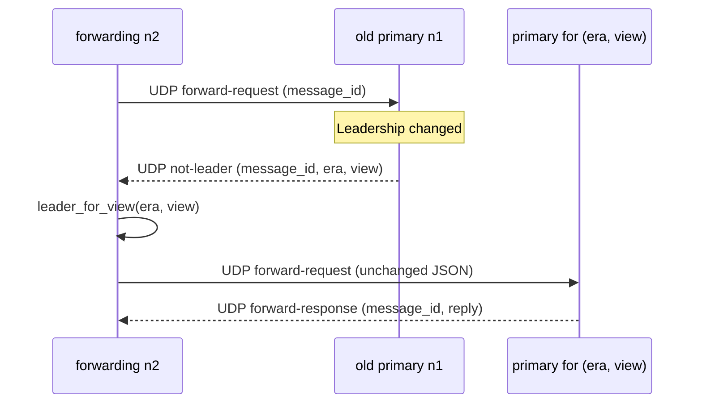

# Architecture and operations

This service is a fixed-membership, advisory-lock application built on
[`vrr-core`](https://github.com/lua-lunet/vrr-core), a sans-IO
Viewstamped-Replication-Revisited (VRR-2012) core. The core is one total
function, `tick + message + state -> state + list(messages)`; the host owns
time, transport, storage, packetization, threading, and naming. The service
deliberately keeps the application protocol separate from replication:
`vrr-core` orders requests; the local adapter executes only committed lock
commands and correlates their JSON replies.

## Components



The **LAL Peer Protocol** is this service's UDP framing and forwarding layer.
It is not a replacement for VRR and it does not define replication state.
Its two jobs are to guard fixed membership at the transport boundary and to
carry service-specific forwarding packets alongside opaque VRR datagrams.

The Rust adapter retains the lock state machine, the tick clock, exactly-once
reply correlation, and the durable recovery nonce. Teal owns sockets, TCP
framing, peer source validation, forwarding, and deterministic draining of
native output buffers. The Teal wrapper never retains a borrowed Rust pointer;
`close()` is idempotent and its LuaJIT finalizer is only a fallback.

## The adapter

The adapter instantiates the concrete core `Replica<SegmentedLog,
WeightedMajority>` running `Stability::Volatile`, provisioned over an empty
journal with the host-supplied member order as the genesis succession
sequence. Every input is wrapped in a `TimedInput` whose tick the adapter
stamps, planned against an atomic journal view, and published; the inert
effects the core releases are drained in the same call. A `Send { to, era,
message }` effect is encoded with the core's binary codec and queued as one
unicast datagram per destination — the core materializes fan-out as one send
per member, and the adapter routes each as addressed. An `Apply { slot,
operation_id, payload }` effect is executed against the lock service, and the
adapter feeds the resulting `Input::Applied { slot }` acknowledgement back
into the core until it goes quiet.

Identity is positional: the member at index `i` in the host-supplied order is
`NodeId(i)`, and the same order is the genesis succession sequence, so view
`v` selects primary `order[v mod N]`. Peer indices on the ABI are these
positional indices. Operation identity is the client request's 16-byte
`message_id`: the first 8 bytes become the operation id's most-significant
word and the last 8 its least-significant word, both big-endian. The operation
payload is the client JSON bytes unchanged.

Exactly-once semantics are host-side. The core never deduplicates and never
answers a proposal, so the adapter caches each executed reply by `message_id`
and replays the cached bytes for a duplicate request or a duplicated committed
operation, without re-executing the lock service. A reply output is queued
only for an operation this node proposed and still holds locally pending.

The core carries operation payloads opaque and validates none of them, so the
adapter re-checks every peer-carried operation entry — in Prepare,
DoViewChange, StartView, RecoveryResponse, and NewState messages — against the
lock service before the message reaches the core. An entry whose payload does
not decode as a valid service request, or whose embedded `message_id` does not
match the operation identity the entry claims, condemns the whole datagram.

A panic anywhere in the adapter poisons the node: pending outputs are
discarded and every subsequent call reports the poisoned state until the
process restarts. The same poison applies if the core ever surfaces a
durability handshake this host does not implement, or an application-state
shortfall it cannot repair — the adapter never fabricates state or a
durability outcome.

## Client path

TCP is exclusively client-facing. A connection carries one newline-delimited
UTF-8 JSON request at a time; it can carry more requests sequentially after a
response. Partial reads and multiple frames in one read are retained
correctly. Each request must fit within the UDP datagram-sized service limit
because a non-primary may need to forward it unchanged; the adapter refuses a
request whose worst-case replicated Prepare encoding would exceed one
datagram before proposing it.



A primary submits a client request locally. A non-primary forwards it to the
primary it currently knows. The forwarding node retains the original JSON and
canonical 16-byte `message_id` until the matching response arrives. Duplicate
client retries attach to that in-flight correlation rather than submit a new
operation. The normal client deadline is 30 seconds; on expiry the service
closes the TCP connection, and the client retries the *unchanged* envelope.

## LAL Peer Protocol

All cluster-internal traffic uses raw UDP between configured member endpoints.
Before a UDP payload is handled, the receiver verifies that the source IP and
port exactly match a configured member. It then decodes this outer envelope:

```text
\0LUNET_ADVISORY_LOCK_PEER\0 | kind | membership fingerprint | payload
```

`kind` is either opaque VRR traffic or a service application packet. The
fingerprint is the first 16 lowercase hexadecimal characters of SHA-256 over a
domain-separated, length-delimited encoding of the validated lexical member
list (name, IPv4 endpoint, and port). Thus the same fixed membership has one
stable value, logged at startup as:

```text
advisory-lock membership fingerprint=<fingerprint> encoding=lunet-advisory-lock/membership/v1
```

The service wraps *every* native outbound VRR datagram and every application
packet in this envelope. It unwraps and compares the fingerprint before either
passing a packet to `vrr-core` or routing it as an application message. This
guards against accidentally connecting differently configured development,
test, or production clusters.

If a configured peer sends a valid envelope with a different fingerprint, the
replica becomes **dirty**. It logs the configured and received fingerprints to
both stdout and stderr, closes its TCP listener and active client work, and
continues its peer/recovery loops. It does not exit: this avoids a local crash
loop while TCP readiness correctly reports it unavailable. Operators must fix
the membership configuration and restart the replica.

## Wire format

Inside the peer envelope, VRR payloads are the core's normative binary codec:
a 20-byte big-endian header `(tag: u32, era: u32, view: u32, slot: u64)`
followed by a one-byte body discriminant and fixed-width big-endian body
fields. There are no varints and no JSON on the wire. The core owns no size
limit; the host owns packetization, bounding every datagram to one IPv4/IPv6
UDP payload (65,507 bytes). The adapter reports each queued send's era, view,
and slot from the encoded message's header so the host never has to decode it.

## Leadership changes and forwarding

Forwarding packets have a distinct application tag inside the peer envelope:

- `forward-request`: canonical message ID plus the original JSON request;
- `forward-response`: canonical message ID plus the JSON reply;
- `not-leader`: canonical message ID plus the responder's current era and
  view, each an unsigned 32-bit big-endian value.

The fixed ordered membership maps an era-and-view pair to its primary.
Consequently a `not-leader` reply does not include a separate leader identity:
the forwarding node asks its local adapter for the primary of that era and
view, immediately redirects the retained original request when known, and
otherwise resumes normal retry.



Only the replica to which a request was most recently forwarded may redirect
that request. An unknown primary simply leaves the request pending until
normal discovery/retry succeeds; the adapter reports "primary unknown" for an
era outside the core's three-era retention window or a booting cluster. A node
that is not primary never executes the forwarded application command.

## Status surface

The adapter reports the replica's current mode — `normal`, `view_change`,
`recovering`, or `replaying` — together with the current era, current view,
and the positional index of the current view's primary. `leader_for_view(era,
view)` answers the primary of an arbitrary era-and-view pair through the
replica's configuration history, or "unknown" when the era falls outside the
retention window.

## Time, recovery, and durability

The adapter owns the tick clock: a monotonic nondecreasing
milliseconds-since-Unix-epoch value, clamped per node so a wall-clock
regression never reaches the core. Every input the adapter feeds the core
carries such a tick. The core's single liveness input is a tick; the service's
heartbeat and election loops both drive it, and the core's configured
primary-timeout knob — five seconds of primary silence — is what fences a
backup into the next view.

The `--state` file stores the recovery nonce, the only bytes this service
ever fsyncs. First boot creates it; every boot and every recovery retry
atomically increments it (write, fsync, rename, parent-directory sync) and
uses the new value as the recovery input's tick — the recovery nonce *is* the
tick, so per-node monotonicity holds across the two clock sources.

Every boot enters fenced recovery: the node provisions over an empty journal
and immediately drives a recovery attempt stamped with a fresh durable nonce.
Recovery needs a live quorum; a recovering node rejoins from quorum memory,
installing the latest fenced view's history and re-applying its committed
suffix. A fresh cluster bootstraps the same way: every node fences, the
genesis primary self-promotes on a tick, and the recovering backups adopt the
view.

Durability is a stated property of the design. Under `Stability::Volatile`
the core keeps protocol state in quorum memory, not local storage: a rolling
single-node restart recovers from the surviving members, while a simultaneous
full-cluster loss forfeits whatever the quorum held. An operator
re-bootstrapping a lost cluster must do so only after all outstanding leases
can no longer be valid.

Default timers are 200 ms heartbeat, a 1,200 ms election floor plus a 200 ms
per-node stagger, and 2,500 ms recovery retry. Override them with
`--heartbeat-ms`, `--election-ms`, and `--recovery-ms`.

Membership is fixed for one process lifetime. Peer transport is expected to be
on a private network; deployment infrastructure supplies encryption or other
network controls if required. Clients keep a stable `client_id`, use
increasing `request_num` values, retain only one outstanding request, and
retry the exact same envelope. See [the client protocol](client-protocol.md)
for request and reply semantics and
[vrr-core](https://github.com/lua-lunet/vrr-core) for all replication
mechanics and safety proofs.
