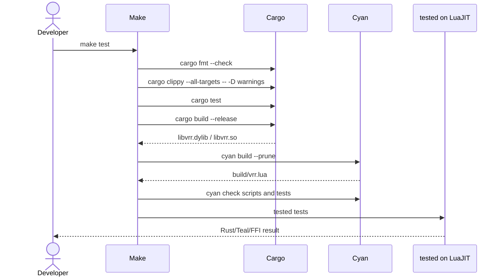

# Build and Tests

## One ordered entrypoint

`make` owns orchestration. Rust finishes before Cyan, and Cyan finishes before `tested`:



The dependency chain is:

```text
test -> check -> build -> ext -> ext-test -> ext-check
```

This means the Teal wrapper is never built against a missing or stale native release artifact.

## Rust tests

The Rust suite is intentionally small. It gives confidence in shape and basic behavior before a
later specialist invariant-testing phase:

- serde JSON client round-trip;
- free/live/expired SET behavior;
- parsed-request cache avoids reparsing;
- fixed 16-byte header and membership validation;
- normal PREPARE/PREPARE_OK/execute and duplicate reply;
- COMMIT-before-PREPARE retention;
- qualified new-leader report during epoch change;
- exact-maximum-epoch leader recovery.

It does not attempt exhaustive scenario enumeration with example-based unit tests.

The protocol requires arbitrary odd or even `K >= 3`. In particular, `K = 4` means `f = 1` and
`Q = 3`: commitment needs the leader's self-accept plus two backup acknowledgements, epoch change
needs three qualified reports including the prospective leader, and recovery needs three other
normal responders. No dedicated `K = 4` test currently establishes that hardening; adding one is
required before claiming that even-membership behavior is covered.

## Teal and LuaJIT tests

`tests/vrr_ffi_test.tl` is type-checked by Cyan, then run by `tested` under the same LuaJIT family
used by the application. It covers:

- native membership validation;
- malformed and over-datagram client input rejected before log mutation;
- three-node request -> PREPARE -> PREPARE_OK -> JSON reply;
- UUID correlation and duplicate cached reply;
- exact header metadata at the Teal boundary;
- embedded-NUL peer bytes passed with their full length and rejected when trailing data is invalid.

Every `tested.test` contains a real assertion because `tested` reports no-assert tests and unhandled
exceptions as invalid rather than failed.

## Documentation build

`make docs` runs `docs/docs`. It is an executable Python script with uv inline metadata:

```python
#!/usr/bin/env -S uv run --script
# /// script
# requires-python = ">=3.12"
# dependencies = ["zensical"]
# ///
```

No global Python environment or globally installed Zensical is required. Zensical reads
`docs/zensical.toml`, renders Mermaid diagrams from Markdown, and writes the generated site to
`docs/site/`.

## Relevant files

| File | Responsibility |
|---|---|
| `ext/vrr/src/locks.rs` | serde JSON client protocol and lock state |
| `ext/vrr/src/vrr.rs` | VRR state machine and peer wire codec |
| `ext/vrr/src/ffi.rs` | combined node facade and C ABI |
| `src/ffi.d.tl` | typed LuaJIT FFI surface used by Teal |
| `src/vrr.tl` | typed Teal wrapper and output draining |
| `tests/vrr_ffi_test.tl` | outer LuaJIT/FFI forward pass |
| `Makefile` | ordered build and test graph |

Struct and parameter ordering SHOULD follow
[NOMA Collected Ordering](https://gist.github.com/simbo1905/c969d505ca531a301fea7f24f52ee0c9),
as summarized in `CONVENTIONS.md`.
