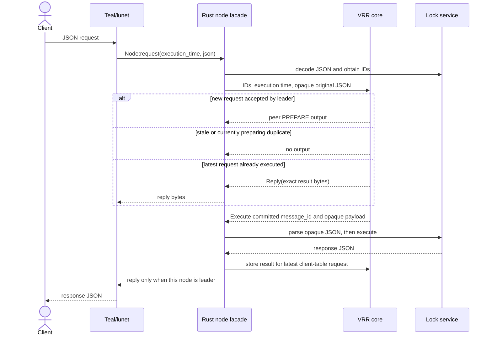

# External Client Protocol

Clients send JSON. This is the advisory-lock application protocol, not the VRR peer protocol. Teal
passes these bytes through the FFI without parsing them. Rust uses serde JSON.

## GET request

```json
{
  "op": "get",
  "message_id": "01010101-0101-0101-0101-010101010101",
  "client_id": 42,
  "request_num": 7,
  "lock_id": 9001
}
```

## SET request

```json
{
  "op": "set",
  "message_id": "01010101-0101-0101-0101-010101010101",
  "client_id": 42,
  "request_num": 7,
  "lock_id": 9001,
  "lease": {
    "lease_id": 3,
    "holder": "02020202-0202-0202-0202-020202020202",
    "expiry": 1722600001000
  }
}
```

## Fields

| Field | Type | Meaning |
|---|---|---|
| `op` | `get` or `set` | Application operation discriminator |
| `message_id` | UUID | Unique correlation identifier allocated by the client and echoed in the response |
| `client_id` | `u64` | Stable VRR client identity |
| `request_num` | `u64` | Monotonically increasing request number for that client |
| `lock_id` | `u64` | Advisory-lock identifier |
| `lease_id` | `u64` | Client's lease identifier |
| `holder` | UUID | Process or actor holding the lease |
| `expiry` | `u64` | Client-selected wall-clock expiry |

A retry of one logical request carries the same complete envelope. `message_id` is copied unchanged
into the log for application correlation and tracing; duplicate suppression is exclusively by
`(client_id, request_num)`.

Each client uses a stable `client_id`, monotonically increasing request numbers, and at most one
outstanding request. It retries an unanswered request with the envelope unchanged and rejects any
response that does not match the outstanding request.

## Responses

A GET response echoes `message_id`, `request_num`, and `lock_id` and returns either a lease or
`null`.

```json
{
  "op": "get",
  "message_id": "01010101-0101-0101-0101-010101010101",
  "request_num": 7,
  "lock_id": 9001,
  "lease": null
}
```

A SET response reports whether the proposed lease was granted. On rejection, `lease` is the live
incumbent. On success, it is the accepted lease.

```json
{
  "op": "set",
  "message_id": "01010101-0101-0101-0101-010101010101",
  "request_num": 7,
  "lock_id": 9001,
  "granted": true,
  "lease": {
    "lease_id": 3,
    "holder": "02020202-0202-0202-0202-020202020202",
    "expiry": 1722600001000
  }
}
```

## Lease rules

The replicated execution receives one leader-selected predicted execution value. The leader chooses
it before replication and records it with the request, corresponding to the paper's Section 4.4
predicted-value rule. Every replica uses that unchanged value; no replica samples its own clock while
executing the request.

- A lease is live only when `expiry > execution_time`.
- An absent or expired lease is free for any holder.
- A live lease can only be replaced by the same holder UUID.
- The same holder can extend or replace its own lease.
- A rejected SET does not mutate the lock table.
- Expired entries are ignored logically; this core does not need to delete them to answer correctly.

## Request lifecycle



For each `client_id`, the client table contains exactly the largest accepted `request_num` and, if
that request executed, its result. A greater number is admitted and recorded with no result; a lower
number is dropped; an equal number without a result is dropped; and an equal number with a result
resends that result without append or execution. Executing the latest request stores its result
before the leader emits a reply. Installing or reconstructing a log rebuilds the largest accepted
request numbers, and executing only its committed prefix rebuilds cached results.
