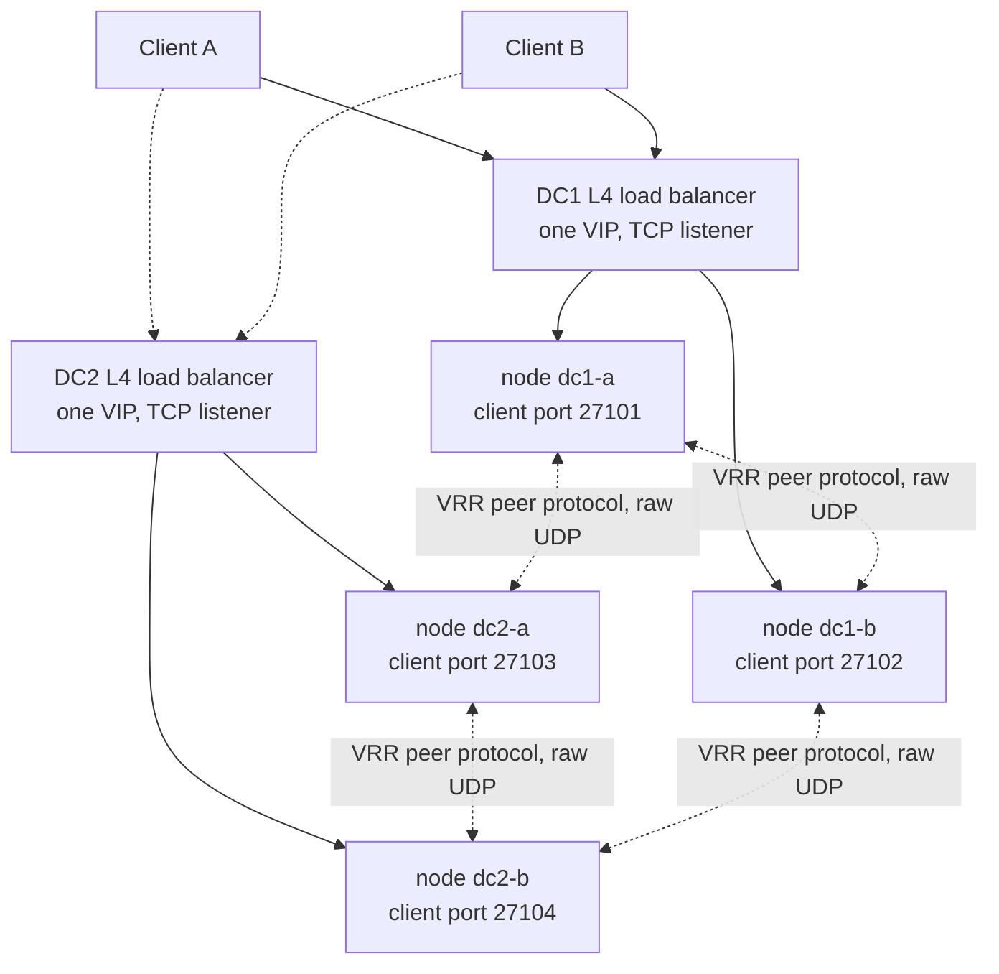

# The client topology: 2x2 nodes behind a cloud L4 load balancer

The deployment this document specifies is two nodes per datacentre, four nodes
in total, each datacentre fronted by one provider's layer-4 load balancer. The
load balancer is the only thing a client ever addresses; the nodes are its
backends. This document states the topology, the verified behaviour of each
provider's balancer that the topology relies on, the client circuit from
connect to reply, and the uuid-to-socket nexus that holds a command's reply
against the socket it arrived on.

The client protocol itself — request shapes, replies, lease counters, the
membership verbs — is [the external client protocol](client-protocol.md). The
replication, forwarding and membership machinery is
[architecture and operations](architecture.md). The layering and the
observability contract are [the test scaffold](test-scaffold.md).

## The topology



Two properties of the balancer front end are the whole design, and both are
configuration rather than code:

- **One VIP per datacentre, one TCP listener, both nodes registered as
  backends.** The balancer distributes *connections*, not requests. A node is
  a peer of the other node in its datacentre and of both nodes in the other
  datacentre; the four-node configuration is the deployment descriptor, and the
  VIPs appear nowhere in it.
- **No connection affinity.** Every balancer here distributes new connections
  across healthy backends with no stickiness configured, and the design needs
  none: the replication protocol routes a request to the leader and the leader
  commits it, so which node a client's connection lands on carries no
  authority. Affinity would trade a load-balancer feature for the cost of
  pinning a client to a node that may be the one that dies.

The clients keep a stable `client_id`, an increasing `request_num`, and one
outstanding request at a time. A retry re-sends the *unchanged* envelope, and
replication deduplicates it by `(client_id, request_num)` and replays the first
execution's exact reply.

## Health checks

The balancer's health check decides which nodes may receive *new connections*.
It is the only mechanism by which the balancer learns a node is gone, so its
cadence sets the worst-case time a client spends talking to a dead node.

- **AWS NLB**: active health checks on the target group, TCP or HTTP/HTTPS.
  `HealthCheckIntervalSeconds` ranges 5–300 s with a 30 s default, and
  `HealthyThresholdCount` ranges 2–10 with a default of 5 — so a TCP target
  that stops answering is marked unhealthy after roughly five consecutive
  failed probes. Checks are distributed across the load balancer's nodes and
  use a consensus mechanism, so a target receives *more* probes than the
  configured interval implies. TCP health checks pass when the prober opens a
  connection before the health check timeout.
  ([target group health checks](https://docs.aws.amazon.com/elasticloadbalancing/latest/network/target-group-health-checks.html))
- **Azure Standard Load Balancer**: a custom TCP, HTTP or HTTPS probe. A TCP
  probe fails when the instance's TCP listener does not respond at all within
  the timeout period, and also when the probe receives a TCP reset from the
  instance. A probe is marked down based on the number of consecutive timed-out
  probes that were configured to go unanswered.
  ([Azure Load Balancer health probes](https://learn.microsoft.com/en-us/azure/load-balancer/load-balancer-custom-probe-overview))
- **GCP external passthrough NLB**: a health check on the backend service, with
  a protocol that may differ from the forwarded protocol. For a TCP health
  check the prober must successfully open a TCP connection to the backend
  before the health check timeout, and the connection must then be closed by a
  FIN from either side or a FIN/RST from the prober. A backend sending RST can
  make the probe count as unsuccessful when the prober has already sent its
  FIN. Probers only attempt to connect to VM instances that are running; a
  stopped instance is not probed.
  ([health checks overview](https://docs.cloud.google.com/load-balancing/docs/health-check-concepts))

All three make the health check a *liveness* signal about accepting new work.
None of them is a replication-level signal: a node that fails its health check
is removed from the balancer's backend set and the remaining nodes carry the
quorum on their own.

## What a client sees when a node dies mid-connection

This is the behaviour the client circuit is built around, and the three
providers differ in a way that matters.

- **AWS NLB — a TCP RST, by default, immediately.** "If a target becomes
  unhealthy, the load balancer sends a TCP RST for packets received on the
  client connections associated with the target, unless the unhealthy target
  triggers the load balancer to fail open." Connection termination for
  unhealthy targets is a target group attribute, default **disabled** for TCP
  target groups, and it must be disabled before the unhealthy draining interval
  can be enabled. With it disabled the behaviour is a RST; with it enabled the
  connection is drained and then closed. Separately, on idle timeout "if a
  client or a target sends data after the idle timeout period elapses, it
  receives a TCP RST packet to indicate that the connection is no longer valid".
  ([NLB target group health checks](https://docs.aws.amazon.com/elasticloadbalancing/latest/network/target-group-health-checks.html),
  [troubleshoot your Network Load Balancer](https://docs.aws.amazon.com/elasticloadbalancing/latest/network/load-balancer-troubleshooting.html),
  [edit target group attributes](https://docs.aws.amazon.com/elasticloadbalancing/latest/network/edit-target-group-attributes.html))
- **Azure Standard Load Balancer — established TCP flows continue.** The
  documented probe-down table: with a single instance probing down, "New TCP
  connections succeed to remaining healthy backend endpoint. Established TCP
  connections to this backend endpoint continue." With *all* instances probing
  down, "No new flows are sent to the backend pool. Standard Load Balancer
  allows established TCP flows to continue given that a backend pool has more
  than one backend instance." And in general: "A probe down signal always allows
  TCP flows to continue until idle timeout or connection closure in a Standard
  Load Balancer." The client learns of a dead backend by its **own** client
  deadline expiring, not by the balancer. On idle timeout the balancer's default
  is to *silently drop* flows; sending bidirectional TCP resets on idle timeout
  is a per-rule opt-in.
  ([health probes](https://learn.microsoft.com/en-us/azure/load-balancer/load-balancer-custom-probe-overview),
  [TCP reset and idle timeout](https://learn.microsoft.com/en-us/azure/load-balancer/load-balancer-tcp-reset))
- **GCP external passthrough NLB — the backend's own behaviour, per flow.** The
  balancer is not a proxy: "the load balancer itself doesn't terminate user
  connections", packets reach the VM with source and destination unchanged, and
  responses return directly to the client by direct server return. Connection
  state is a 5-tuple hash entry, and with that hash in play: "If the unhealthy
  backend continues to respond to packets, the connection continues until it is
  reset or closed (by either the unhealthy backend or the client). If the
  unhealthy backend sends a TCP reset (RST) packet or does not respond to
  packets, then the client might retry with a new connection, letting the load
  balancer select a different eligible backend."
  ([passthrough NLB overview](https://docs.cloud.google.com/load-balancing/docs/passthrough-network-load-balancer),
  [traffic distribution](https://docs.cloud.google.com/load-balancing/docs/network/ext-netlb-traffic-distribution))

**The behaviour this design relies on, per provider.** Azure: the client
notices through its own deadline, so the deadline is load-bearing and the retry
is the whole recovery. GCP: a dead backend's silence becomes a RST from the
node's own TCP stack, so the client sees a reset rather than a hang. AWS: the
balancer itself sends the RST on the unhealthy transition, which is the
fastest of the three and the one the client circuit must not depend on — the
same client code has to survive Azure's silence, so the circuit is built to the
slowest provider, Azure, and AWS's earlier RST is simply an earlier answer to
the same question.

The two nodes per datacentre are what make any of this survivable: with one
backend per datacentre, Azure's "established TCP flows continue" would leave
every client of a dead node hanging until its own deadline with no second
backend to reach.

## Idle timeouts

| Provider | Default | Range | Modifiable |
|---|---|---|---|
| AWS NLB, TCP listener | 350 s | 1–6000 s (`tcp.idle_timeout.seconds`) | yes, per listener |
| Azure Standard LB, load-balancing rule | 4 min | 4–100 min (outbound rules 4–120 min) | yes, per rule |
| GCP external passthrough NLB | 60 s | fixed | **no** |

AWS: "The default idle timeout value for TCP flows is 350 seconds"
([update the TCP idle timeout](https://docs.aws.amazon.com/elasticloadbalancing/latest/network/update-idle-timeout.html)).
Azure: "Standard Load Balancer supports an idle timeout range of 4 minutes to
100 minutes for load-balancing rules and inbound NAT rules... The default
setting is 4 minutes for all rule types"
([configure TCP reset and idle timeout](https://learn.microsoft.com/en-us/azure/load-balancer/load-balancer-tcp-idle-timeout)).
GCP: "Entries in connection tracking tables expire 60 seconds after the load
balancer processes the last packet that matched the entry. This idle timeout
value can't be modified."
([traffic distribution](https://docs.cloud.google.com/load-balancing/docs/network/ext-netlb-traffic-distribution)).

A 60-second floor that cannot be raised is a hard fact of the GCP front end:
an idle client connection is forgotten by the balancer after a minute whether or
not the application wants it. AWS warns of the matching trap in the other
direction — set the listener idle timeout above the target ENI's connection
tracking `TcpEstablishedTimeout` or "the target's network interface will
silently drop connection state before the load balancer closes the connection".

**What the design relies on.** The client is not idle for 60 seconds: it holds
one outstanding request with a 30-second deadline and re-drives immediately on
refusal or timeout, so every connection carries traffic well inside the
tightest of the three. The service never relies on a connection surviving
idle; the socket is a per-command courier, not a session.

## Cross-zone and cross-node distribution

- **AWS NLB**: cross-zone load balancing is a target group attribute
  (`load_balancing.cross_zone.enabled`) whose default is
  `use_load_balancer_configuration`. Each load balancer node routes only to
  healthy targets in its own Availability Zone unless cross-zone is on.
  ([target groups](https://docs.aws.amazon.com/elasticloadbalancing/latest/network/load-balancer-target-groups.html),
  [target group health checks](https://docs.aws.amazon.com/elasticloadbalancing/latest/network/target-group-health-checks.html))
- **Azure Standard Load Balancer**: distributes across zones by default; a
  probe-down in one zone leaves the other zones' backends serving new
  connections.
  ([health probes](https://learn.microsoft.com/en-us/azure/load-balancer/load-balancer-custom-probe-overview))
- **GCP external passthrough NLB**: health checks determine the *eligible
  backends* for new connections, and every new TCP connection carrying `SYN`
  goes through backend selection afresh — "Each new TCP connection always
  carries the `SYN` flag, and is subject to the processing described in the
  Check for a connection tracking table entry step." Existing flows stay on the
  backend their tracking entry names.
  ([traffic distribution](https://docs.cloud.google.com/load-balancing/docs/network/ext-netlb-traffic-distribution))

The two nodes in a datacentre are two different failure domains under all
three: a zone-scoped backend set still leaves the second node eligible, and the
VRR quorum is a property of the four-node configuration rather than of any
balancer's view of it.

## Connection affinity

Not used, and not needed. AWS offers sticky sessions as a source-IP flow-hash
mapping (`stickiness.enabled`, default `false`,
[target groups](https://docs.aws.amazon.com/elasticloadbalancing/latest/network/load-balancer-target-groups.html));
GCP's connection tracking is an unavoidable 5-tuple hash whose affinity follows
from the protocol rather than from a setting. Neither is configured, because
the request's authority is the leader's, not the connection's: a connection to
a follower is forwarded and a connection to a leader is executed locally, and
both answers are identical. Affinity would pin a client to the node that fails
first, converting a balancer-level recovery into a client-level one.

## The client circuit

```mermaid
sequenceDiagram
    participant C as Client
    participant N as Node (where the connection terminates)
    participant X as uuid-to-socket nexus
    participant R as Replication
    C->>N: connect (TCP, to the datacentre VIP)
    N->>N: accept; the connection is a held socket
    C->>N: one NDJSON command carrying message_id
    N->>X: nexus[message_id] = this socket, this command
    N->>R: propose (locally if leader, forwarded if not)
    R-->>N: the committed reply for message_id
    N->>N: serialise the reply onto the held socket
    N->>C: the reply line
    N->>X: nexus[message_id] = nil
```

One request, one reply, one entry. The socket the command arrived on is the
socket the reply leaves on, and the nexus entry that held them together is
dropped the moment the reply is written. The entry is keyed by the request's
own `message_id` — the canonical 16 bytes of the client's UUID — so the entry
is found by reading the reply, not by scanning connections. A duplicate retry
of that same `message_id` attaches to the entry already in flight rather than
opening a second one.

The entry is dropped on every exit, not only on success: a client deadline
expiry, a dropped socket, a guard that closes the listener, and a dirty
membership quarantine all drop the entries they own and close the sockets they
name. An entry that outlives its socket would be a reply written to a dead
handle.

## The one-outstanding rule

One outstanding request per client is a **safety** property of this
topology, not a throughput preference: the nexus maps a command's uuid to the
socket the command arrived on, and the number of entries a connection may hold
at once is one. A second, different command arriving on a connection that
already holds one is **refused by name**, never queued behind it.

The refusal is a named line on the same socket, in the same JSON shapes the
protocol already uses:

```json
{"error":"request_outstanding","message_id":"02020202-0202-0202-0202-020202020202"}
```

The refused command never enters the replication log, never reaches the lock
state machine, and never allocates a nexus entry. A retry of the command that
*is* outstanding — the same `message_id` — is not a second outstanding request:
it attaches to the entry already held and is answered by it.

The decision is taken at **arrival**, which is the only moment the law has
teeth. A connection's commands are served one at a time to their replies, so a
read that carries more than one command is a client that wrote a second before
reading the first reply, and every command after the first in that write
arrived while the first was outstanding: all of them are refused by name. The
connection survives the refusal, and the next command — written after the reply
is read — is served normally. A client that waits for each response, as
[the client protocol](client-protocol.md) requires, never sees a refusal.

The refusal is observable as its own named log event, carrying the era and view
the refusal was taken under:

```json
{"ts":1789725518000,"level":"INFO","event":"client-request-refused","node":1,"era":4,"view":4,"state":"normal","reason":"request_outstanding","message_id":"02020202-0202-0202-0202-020202020202"}
```

## Rebalancing after a node dies

The balancer stops sending new connections to a node its health check has
marked unhealthy. A client whose connection was on that node observes one of
the three behaviours above, re-drives its **unchanged** envelope, and the new
TCP connection lands on a healthy node — possibly in the other datacentre.
Replication deduplicates the re-driven envelope by `(client_id, request_num)`
and replays the first execution's reply if the command had in fact committed
before the node went away, so a re-drive after a committed-but-unanswered
command returns the original answer rather than executing twice.

A client that re-drives onto a *follower* has its command forwarded to the
leader over the VRR peer channel and the committed reply returned on the same
forward. A client that re-drives onto the *leader* has it executed locally. The
client cannot tell which it got, and does not need to.

No session migrates. The socket a client held before the failure is gone, and
the replacement socket is a different socket with a different entry in the
balancer's connection tracking. The nexus is per-command and per-connection, so
nothing carries over except the client's own envelope.

## What this topology proves, and what it does not

**It proves.** That a client can hold a connection to a datacentre VIP, have a
command's uuid hold the reply against the socket the command arrived on, and
receive that reply on that socket, while a node behind the balancer dies and
the balancer's own failover behaviour — a reset on AWS, continued flows and a
client-side deadline on Azure, the backend's own reset on GCP — is survived by
re-driving the unchanged envelope. It proves the one-outstanding rule is
enforced by name rather than absorbed by a queue, and that the nexus entry is
dropped on every exit path. It proves that no balancer-level affinity is needed
for correctness, because the leader holds the authority and not the connection.

**It does not prove.** That a request survives the balancer: a request in flight
on a connection the balancer tears down is answered by re-drive, never by the
original connection. That the load balancer is a member of the trust boundary:
the TCP client channel has no separate authentication, exactly as
[the client protocol](client-protocol.md) states, and every balancer here
preserves the client source address only where its own defaults allow it
(AWS disables client IP preservation by default for IP-type TCP target groups
and cannot disable it for UDP,
[target group attributes](https://docs.aws.amazon.com/elasticloadbalancing/latest/network/edit-target-group-attributes.html);
GCP's passthrough balancer preserves it by not proxying at all). And
nothing here says anything about the peer protocol between datacentres, which
[architecture](architecture.md) specifies and which is expected to run on a
private network with encryption supplied by the deployment.

## The load balancer comparison

| Behaviour | AWS NLB | Azure Standard LB | GCP external passthrough NLB |
|---|---|---|---|
| Client protocols | TCP, UDP | TCP, UDP | TCP, UDP, ESP, GRE, ICMP, ICMPv6 (regional, backend-service) |
| Connection model | proxy — terminates and re-originates | proxy — HA ports, or floating IP/DSR | **not a proxy** — DSR, backend terminates |
| Health check | active, TCP/HTTP/HTTPS; 30 s interval, 5 healthy threshold (5–300 s / 2–10) | active, TCP/HTTP/HTTPS; marked down on configured consecutive timeouts | active, any protocol independent of the forwarded one; stopped VMs not probed |
| Client sees a dead target | TCP RST on the unhealthy transition (default) | established TCP flows **continue**; all-probes-down still continues | the unhealthy backend's own behaviour: RST, or silence until the client acts |
| Connection termination for unhealthy targets | target group attribute, default **disabled** for TCP | n/a — flows continue to idle timeout | connection draining, default **disabled**; off means tracking entries are dropped on failover |
| Idle timeout | 350 s default, 1–6000 s, per listener | 4 min default, 4–100 min, per rule | 60 s, **not modifiable** |
| Cross-zone | attribute, default `use_load_balancer_configuration` | default on | eligible-backend set per zone |
| Affinity available | sticky sessions, source IP, default off | HA ports / floating IP | inherent 5-tuple connection tracking |
| Flow selection | per connection | per connection | per `SYN`, 5-tuple hash |

Sources, per row and per provider:

- AWS NLB: [target group health checks](https://docs.aws.amazon.com/elasticloadbalancing/latest/network/target-group-health-checks.html),
  [target groups](https://docs.aws.amazon.com/elasticloadbalancing/latest/network/load-balancer-target-groups.html),
  [edit target group attributes](https://docs.aws.amazon.com/elasticloadbalancing/latest/network/edit-target-group-attributes.html),
  [update the TCP idle timeout](https://docs.aws.amazon.com/elasticloadbalancing/latest/network/update-idle-timeout.html),
  [troubleshoot your Network Load Balancer](https://docs.aws.amazon.com/elasticloadbalancing/latest/network/load-balancer-troubleshooting.html).
- Azure Standard LB: [health probes](https://learn.microsoft.com/en-us/azure/load-balancer/load-balancer-custom-probe-overview),
  [TCP reset and idle timeout](https://learn.microsoft.com/en-us/azure/load-balancer/load-balancer-tcp-reset),
  [configure TCP reset and idle timeout](https://learn.microsoft.com/en-us/azure/load-balancer/load-balancer-tcp-idle-timeout),
  [load balancer best practices](https://learn.microsoft.com/en-us/azure/load-balancer/load-balancer-best-practices).
- GCP external passthrough NLB: [overview](https://docs.cloud.google.com/load-balancing/docs/passthrough-network-load-balancer),
  [traffic distribution](https://docs.cloud.google.com/load-balancing/docs/network/ext-netlb-traffic-distribution),
  [health checks overview](https://docs.cloud.google.com/load-balancing/docs/health-check-concepts),
  [configure failover](https://docs.cloud.google.com/load-balancing/docs/network/networklb-setting-up-failover).

## Where the nexus pattern came from

The uuid-to-socket nexus is the same shape as the frame-multiplexed broker in
[lunet-backproxy](https://github.com/lua-lunet/lunet-backproxy), read for its
abstractions rather than its code. Backproxy's DMZ broker holds a pool of
outbound worker connections and multiplexes framed requests over them; each
frame's header carries an explicit `kind`, an explicit `id` and an explicit
length, and a reply is accepted only when `resp.kind` and `resp.id` match the
request that was sent — a mismatch is a protocol fault that removes the peer
rather than a reply that is quietly attributed to the wrong caller
(`app/dmz/broker.lua`, `app/common/frame.lua`).

Taken: the **id-in-the-header** discipline, which is this service's 16-byte
`message_id` as the frame id and therefore the nexus key; the
**reply-must-match-the-request-id-or-it-is-a-fault** rule, which is why the
nexus is keyed by the uuid rather than by connection order; the **pool entry
is removed when its socket fails** discipline, which is why a nexus entry is
dropped on every exit path; the **named refusal at admission** — backproxy
answers `BUSY` on the wire when a pool is at its bound rather than queueing
silently — which is the one-outstanding refusal's shape; and the **readable
pool status** an operator can ask for.

Rejected: backproxy's **idle-worker poll** (`wait_for_idle` retrying a fixed
number of times before failing), because a timed poll is a silent queue with a
timer on it and this design refuses by name instead; its **silent three-attempt
dispatch retry** of the same request id across workers, because this service's
duplicate handling replays the first execution's reply and never re-executes;
its **`math.random` request id**, because the request id here is the client's
own UUID carried through unchanged; its **whole-handler `pcall` that closes the
socket on any fault without naming the fault**, because every refusal in this
protocol is named; and its **free-text service registry** (`HELLO <service>`
with no authentication of the service name), because the membership verbs are
already operator-trusted on the client channel by stated policy and a second,
weaker identity system beside it would be a worse one.
