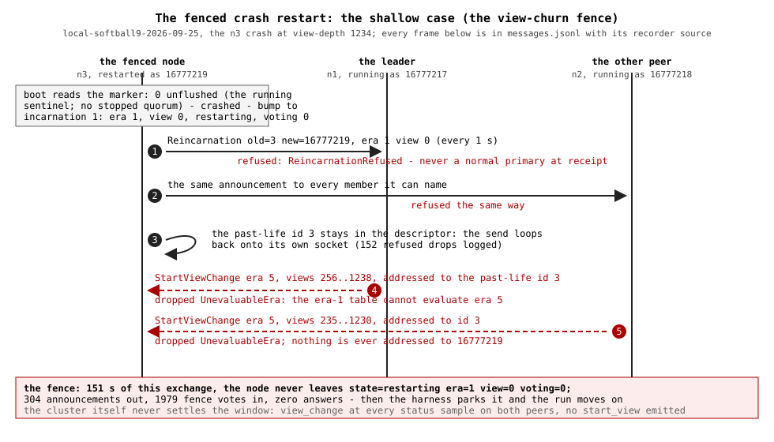

# The fenced crash restart

The crash-restart scenario stops a voter (SIGKILL, no drain) and boots it
again on the same durable state. The boot gate reads the marker, classifies
the start crashed (no stopped quorum), and the node reincarnates: it takes
the marker pair's next life (the same system half, the crash counter
advanced) and announces
`Reincarnation(old, new)` to every member it can still name, once per
second, until it stops being fenced. The leader of a settled view answers
the announcement with the missed-range push and drives the forced weight
sequence that walks the node back to voting weight.

This page is the evidence pack for the run where that walk never happened.
The run is `local-softball9-2026-09-25` (the recording build's header commit
is `1b9ba4b`, recorded with the dirty-tree override; the run predates the
identity-law packing, so the recorded ids are the superseded band's). Its
`progress.log` declares three crash-restart cases BLOCKED; this page files
the shallow n3 case (the view-churn fence) in full and the deep n3 case
(the install that never lands) at the fence phase. The in-process
reproductions that replay this page's committed capture against a lone node
in seconds live in
`examples/lease-sequencer/tests/rejoin_fence_reproduce_test.rs`; both are
filed RED.

## The shallow case: the view-churn fence

The scenario crashed n3 while the cluster sat at era 5 view 44. The
restarted process booted at ts_ms 1790315607438 under the bumped identity
16777219, era 1, view 0. For the next 151 seconds the cluster churned
views — both peers in `view_change` at every two-second status sample, the
fence votes addressed to the fenced socket spanning views 235 to 1238 — and
never once settled `normal` (neither peer's tape carries one `start_view`
in the window). Then the harness declared the rejoin blocked
(`view_depth_at_stuck=1234`, `newest_diagnostic=UnevaluableEra`), parked
the node, and stopped it.

### The message exchange

The full window, from the peers' flight recorders (the fenced node's own
segment was later pruned by the recorder's keep-two rotation; the journal
covers it). The capture commits the first and last frames of each class;
every row names its recorder source, and the committed copy is
[`messages.jsonl`](fenced-crash-restart/messages.jsonl).

| # | From | To | Message | Era | View | Slot | Receiver action | Capture (jsonl line — recorder file:line, seq) |
|---|------|----|---------|-----|------|------|-----------------|---------|
| 1 | 16777219 | 16777217 | Reincarnation old=3 new=16777219 committed=2 prepared=2 | 1 | 0 | 0 | Refused: `ReincarnationRefused` — the receiver is in `view_change`, and the armed-leader precondition is a `normal` primary of the current view | [L3](fenced-crash-restart/messages.jsonl#L3) — flight-16777217-1790316184444.jsonl:59604, seq 59603 |
| 2 | 16777219 | 16777218 | the same announcement | 1 | 0 | 0 | Refused the same way | [L4](fenced-crash-restart/messages.jsonl#L4) — flight-16777218.jsonl:37499, seq 37498 |
| 3 | 16777219 | 3 | the same announcement, addressed to the past-life id the descriptor still names | 1 | 0 | 0 | The transport's own remap row loops it back; the node drops it `ReincarnationRefused` (it is not the leader) — 152 logged | the generation's journal totals at [L9](fenced-crash-restart/messages.jsonl#L9) |
| 4 | 16777217 | 3 | StartViewChange | 5 | 256 | 0 | Dropped `UnevaluableEra`: the era-1 table holds no era-5 record | [L5](fenced-crash-restart/messages.jsonl#L5) — flight-16777217-1790316184444.jsonl:59627, seq 59626 |
| 5 | 16777217 | 3 | StartViewChange — the last of this peer's in the window | 5 | 1238 | 0 | Same drop | [L6](fenced-crash-restart/messages.jsonl#L6) — flight-16777217-1790316184444.jsonl:119372, seq 119371 |
| 6 | 16777218 | 3 | StartViewChange | 5 | 235 | 0 | Same drop | [L7](fenced-crash-restart/messages.jsonl#L7) — flight-16777218.jsonl:37520, seq 37519 |
| 7 | 16777218 | 3 | StartViewChange — the last of this peer's in the window | 5 | 1230 | 0 | Same drop | [L8](fenced-crash-restart/messages.jsonl#L8) — flight-16777218.jsonl:100255, seq 100254 |

The window's totals, sender tapes against the receiver journal: 304
announcements out (152 per peer, the boot's wire phase plus one drive per
second), 1979 fence votes in (the journal's `UnevaluableEra` count for the
same generation is exactly 1979), and zero frames of any other kind — no
frame was ever addressed to the bumped identity. The fence votes kept
arriving addressed to the past-life id 3: the peers' sender tables still
named it (it remains a voter of the committed era-5 configuration — the
forced sequence that would evict it never ran), and the restarted node's
transport delivered them under the descriptor rows 1 and 2 (the bumped
rows are learned from an announcement on the socket, in memory only, and
the peers never re-announced while voting; the journal's drop class is
`UnevaluableEra`, never `UnknownSender`, which only a member-attributed
sender passes to).

### The disk-log events the reproduction needs

| Event | State before | State after | Evidence |
|-------|--------------|-------------|----------|
| The boot gate's marker read | `n3.state` = `0 unflushed` (the running sentinel a SIGKILL leaves: the first latch anchored incarnation 0 and no stop path ever ran) | crashed classification; incarnation 1; own id 16777219 | the bump in the journal (`logs/n3.2026-09-25.log` lines 13305-13308) |
| The deferred durable bump | as above | never landed: the bump's durable write defers to the seated witness, and the node never seated; the next boot re-decided the same pair | the stop lines ahead of the fresh-files boot ("the deferred window drains and exits; the next boot re-decides the pair", same journal ahead of line 41905) |

No journal record, replay log, or committed history participates: the
reincarnation reopens clean over the genesis descriptor.

### The boot-fence state at the lockup

| Fact | Value | Happens-before | Happens-after |
|------|-------|----------------|---------------|
| Durable marker | `0 unflushed` | The genesis life's first latch; the crash (SIGKILL writes nothing) | The boot gate's read at ts 1790315607438 |
| Classification | crashed; incarnation 1; own id 16777219 | The marker read | Every announcement (they name the pair) |
| The node's view | era 1, view 0, `restarting` | The clean reopen over the descriptor | The whole exchange (nothing advanced it) |
| Voting weight | none (the descriptor names 1, 2, 3) | The descriptor | The fence declaration 151 s later, unchanged |
| First fence vote received | era 5 view 235, +29 ms after the boot | The boot | The last at +151 s; the fence measure follows |
| The fence measure | `status=restarting v0:l1 voting=0`, `view_depth_at_stuck=1234`, `newest_diagnostic=UnevaluableEra` | 152 announcement rounds; 1979 dropped fence votes | The parked stop (sigterm at ts 1790315758121) |

## The deep case: the install that never lands

The same crash shape later in the run, against a cluster at view depth 126.
The difference that matters: a settled leader armed on the announcement and
the forced sequence committed the node's promotion — the node's journal
reaches `config_era=5 voting=1` within forty seconds. The fence then held
anyway: the restarted node's transport had never re-learned the leader's
bump (the row is in-memory, the leader announced while the node was down,
and a voting node never re-announces), so the era-5 `StartView` for view
126 and the memo stream arrived under the descriptor id 1, which the folded
era-5 configuration does not name. The journal drops the installs
`StartViewNotFromPrimary` and the stream `UnknownSender`, and the node sat
`state=restarting era=4 view=3` until the harness measured it blocked.

The fold's own wire path rode the recorder segments the keep-two rotation
pruned, so the capture carries the fence phase's surviving frames: the
era-4 fence vote addressed to the past-life id ([L11](fenced-crash-restart/messages.jsonl#L11)),
the era-5 fence vote now addressed to the bumped id ([L12](fenced-crash-restart/messages.jsonl#L12)),
the dropped install ([L13](fenced-crash-restart/messages.jsonl#L13)),
the memo stream's first prepare and commit ([L14](fenced-crash-restart/messages.jsonl#L14),
[L15](fenced-crash-restart/messages.jsonl#L15)), and the window's first
announcement as the leader received it ([L16](fenced-crash-restart/messages.jsonl#L16)).

## The reproduction

`rejoin_fence_reproduce_test.rs` replays the capture against a lone node:
the marker file is the boot-state row above, the network is the captured
frames delivered at their recorded offsets with their recorded attributions,
and the host loop is the fenced node's own (the heartbeat tick, plus the
fenced-boot drive on its one-second cadence, which re-announces the pair).
Both tests assert the contract — the announced restart seats at voting
weight — and both are RED: the node ends each drive exactly where the run
found it, `restarting`, era 1, view 0, voting weight none, in hundredths of
a second of wall time.
